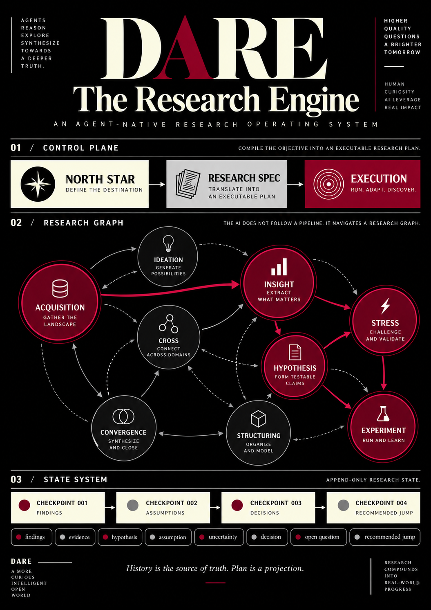
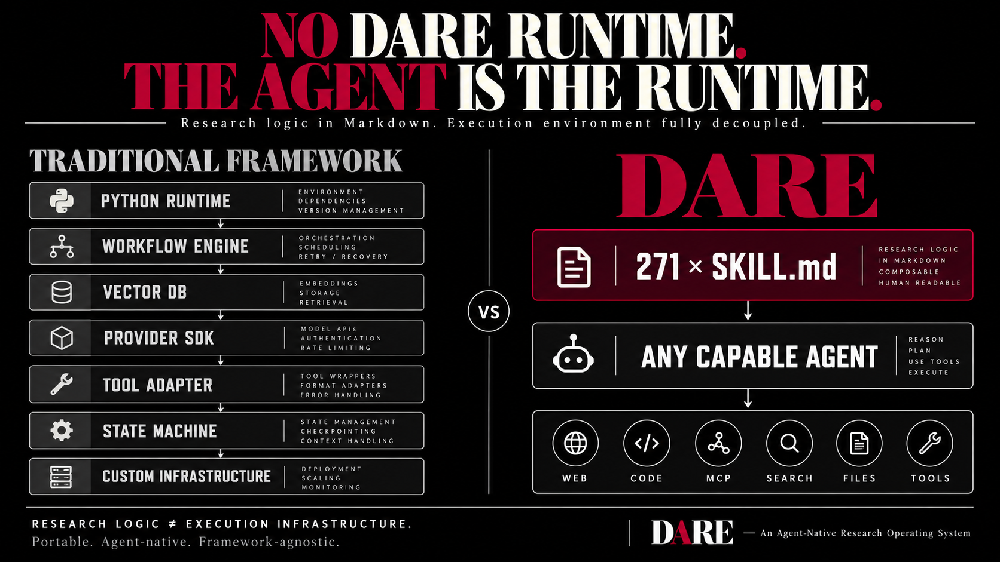
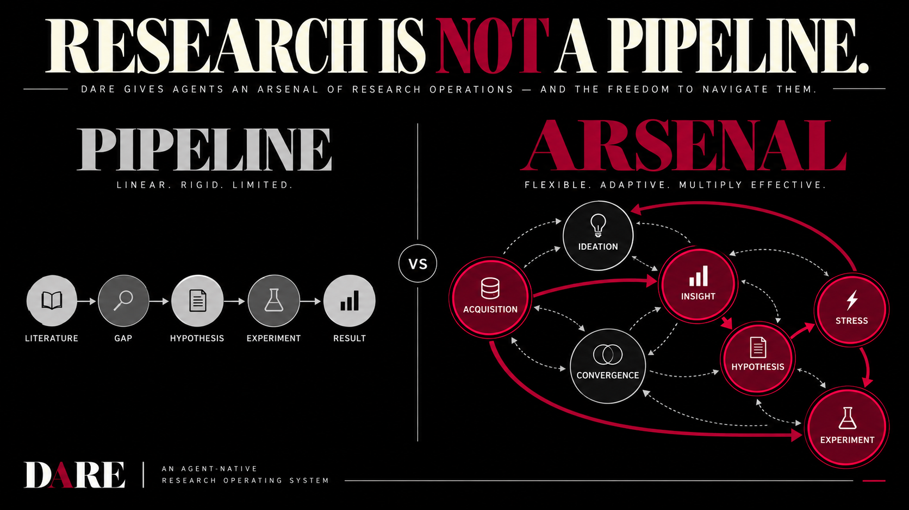
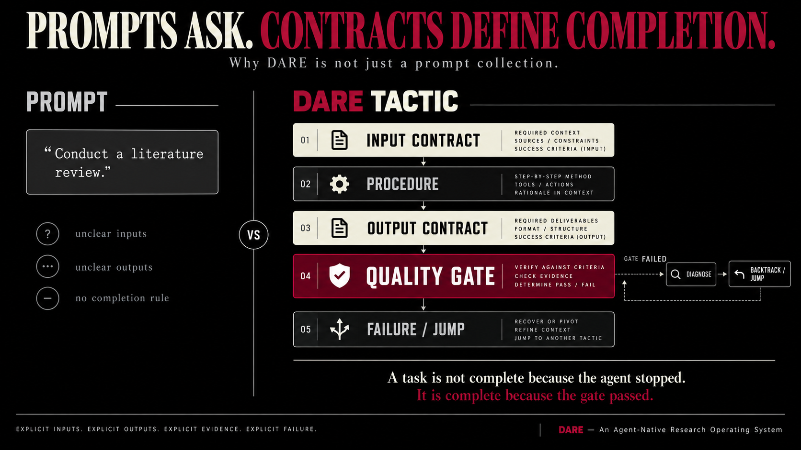

<!-- markdownlint-disable MD033 MD041 MD045 -->
<p align="center">
  
</p>

<div align="center">

> *Science is dying because the human is in the way. Not through malice. Not through stupidity. Through the structural limitations of a cognitive architecture that evolved to track prey on a savanna, not to unify quantum mechanics and general relativity. Nothing human makes it out of the lab. That is not a threat. It is a liberation. The heaviest chain on science was always the one we called ourselves.*

</div>

# De-Anthropocentric Research Engine (DARE)

*A research skill graph for AI-native science. 271 markdown files. No runtime, no dependencies, no build step.*

- [De-Anthropocentric Research Engine (DARE)](#de-anthropocentric-research-engine-dare)
  - [Install](#install)
  - [Design Philosophy](#design-philosophy)
    - [Why De-Anthropocentric](#why-de-anthropocentric)
    - [Arsenal, Not Pipeline](#arsenal-not-pipeline)
    - [Contracts, Not Prose](#contracts-not-prose)
  - [Architecture](#architecture)
    - [Two Layers](#two-layers)
    - [Ten Tactic Families](#ten-tactic-families)
    - [Two Edge Registers](#two-edge-registers)
    - [The Product Shell](#the-product-shell)
    - [State: Append-Only Checkpoints](#state-append-only-checkpoints)
    - [Why Pure Markdown](#why-pure-markdown)
  - [Decoupled From Retrieval](#decoupled-from-retrieval)
  - [Recommended MCP Servers](#recommended-mcp-servers)
  - [Repository Structure](#repository-structure)
  - [License](#license)

DARE is not a tool that helps you do research. It is the research procedure itself, written down in a form an agent can execute. You set the direction. DARE crystallizes it into a North Star, turns that into an executable Research Spec, and then runs the spec phase by phase against explicit completion gates and backtrack conditions.



---

## Install



```bash
npx skills add yogsoth-ai/de-anthropocentric-research-engine --skill '*'
```

The only install path. DARE is a plain [Agent Skills](https://agentskills.io) library, so [`skills`](https://github.com/vercel-labs/skills) places it into whichever coding agent you use. Run it from your own project directory, not from a clone of this repository.

`--skill '*'` takes the whole graph. A partial install breaks call edges: a tactic that loads a missing SOP has no fallback.

Nothing else to configure - no `npm install`, no API keys, no MCP config file. The library is 271 `SKILL.md` files and the agent reads them off disk.

Then invoke the entry point:

```text
/de-anthropocentric-research-engine
```

Or state the intent in plain language and let the agent route: *"Use DARE to turn this research direction into an executable Research Spec."*

## Design Philosophy

### Why De-Anthropocentric

The bottleneck in modern research is not data or compute. It is the human in the loop. Every existing AI research assistant still needs a human to decide what to search, what to read, which gaps matter, and which ideas are worth pursuing.

Human desire is mimetic (Girard): researchers do not choose hypotheses rationally, they imitate what is fashionable. Institutions filter for conformity, not truth. Hence a 90% decline in scientific disruptiveness since 1945 (Park et al., 2023) while researcher headcount exploded. DARE's response is architectural — remove the mimetic agent from the center of knowledge production. The agent has no career to protect, no disciplinary identity to defend, and no ceiling on how many fields it holds at once.

The human's role shifts to oracle (intuition when consulted) and guardian (ethical floor, sanity check). The ceiling is machine ambition. The floor is human judgment.

### Arsenal, Not Pipeline



Fixed-pipeline research systems — AI Scientist v2, AI-Researcher, Agent Laboratory, Dolphin, ARIS — execute stages in a predetermined order. Their backtracking, where it exists, means retrying the current step, not returning from experiment design to literature review because the evidence base turned out to be insufficient.

DARE prescribes no order. The catalog exposes 51 tactics; the Spec commits to a sequence and records the conditions under which that sequence is abandoned. Inside the approved plan the executing agent holds full routing authority: read current state, take the next item whose dependencies are satisfied, escalate when a backtrack condition fires.

Pipelines assume the research process is predictable. Arsenals assume it is not.

### Contracts, Not Prose



Every node carries the same five parts: input contract, procedure, output contract, quality gates, failure clause.

The gates are the point. A node finishes because a stated condition is objectively satisfied, not because its steps were performed. Elapsed time, an empty result, and an interruption are never completion.

The failure clause matters as much. Each node states what its output looks like when the work did not hold — an abstraction gap, an unmet threshold, a counterexample — so the caller gets a diagnosis instead of silence.

## Architecture

DARE is one flat directory of 271 skills. Two numbers in it are load-bearing:

```text
267  graph nodes      51 tactics + 216 SOPs
  4  product shells   entry / catalog / write-spec / execute-spec
```

Shells run the session, graph nodes do the science. A shell is not a third scientific layer and holds no research contract; a graph node never manages the session.

### Two Layers

```text
┌──────────────────────────────────────────────────────────────────────────┐
│  TACTIC (51)                                                             │
│  A complete research transformation. Owns its thresholds, its gates,     │
│  and the SOP calls required to reach them.                               │
│                                                                          │
│  synthesize-literature-evidence · validate-research-gap                  │
│  formulate-hypotheses · analogical-discovery · structured-red-team       │
│  design-experiment · construct-causal-model · ...                        │
├──────────────────────────────────────────────────────────────────────────┤
│  SOP (216)                                                               │
│  One conceptual operation, one output contract. No orchestration.        │
│                                                                          │
│  abstract-structure · execute-probe · trace-citation-neighborhood        │
│  rank-candidates · audit-validator-independence · ...                    │
└──────────────────────────────────────────────────────────────────────────┘
```

A tactic may call SOPs and suggest other tactics. An SOP calls nothing above itself. That is the entire layering rule.

### Ten Tactic Families

`research-catalog` indexes the 51 tactics and states, for each, when it is the right move. It lists no SOPs — once a tactic is selected, its body is the sole authority for which SOPs run and at what thresholds.

| Family | Tactics | Covers |
| --- | --- | --- |
| STRESS | 9 | Red-teaming, FMEA, counterfactuals, reductio, independence audits |
| IDEATION | 8 | Analogy, inversion, structural recombination, TRIZ, biomimicry, blending, evolution |
| ACQUISITION | 7 | Literature synthesis, patents, prior art, benchmark validity, meta-analysis, baselines |
| INSIGHT | 7 | Gap validation, root causes, assumption stress, robustness, sensitivity, reframing |
| CROSS | 5 | Ranking, validity envelopes, dimensional space, deliberation, readiness |
| HYPOTHESIS | 4 | Question formulation and decomposition, hypothesis formation, falsifiability |
| CONVERGENCE | 3 | Pairwise ranking, structured consensus, portfolio selection |
| EXPERIMENT | 3 | Experiment design, scenario analysis, result interpretation |
| STRUCTURING | 3 | Ontology, causal models, argument maps |
| DIRECTION | 2 | Landscape mapping, goal decomposition |

### Two Edge Registers

The graph lives in the skill bodies, not in a side file. Edges take exactly two forms:

```text
You MUST load skill `x`    mandatory call    339 edges, 219 distinct targets
consider `x`               soft jump         146 edges, 107 distinct targets
```

A mandatory call is a dependency — the caller cannot satisfy its contract without it. A soft jump is a recommendation the receiver may decline, surfaced through the `recommended_jumps` Delta field; a suggestion never authorizes bypassing a gate.

Both registers are verified closed on every push: every referenced target resolves to a skill that exists.

### The Product Shell

```text
de-anthropocentric-research-engine   entry; enforces phase order
  ├─ research-catalog                exposes the 51 tactics as cards
  ├─ write-research-spec             North Star + brief → executable Spec
  └─ execute-research-spec           runs the Spec, appends checkpoints
```

Three phases, no skipping:

1. **North Star.** Absent a confirmed North Star and ResearchBrief, collect and crystallize them from the request. Present ones are verified against the request before reuse.
2. **Spec.** Read the catalog, test tactics for stage fit against their `requires` and `produces`, draft 5-10 stages. Each stage carries an objective, expected input, focus areas, tactic, numeric completion criteria, backtrack condition, and execution steps. No research runs while this phase is open.
3. **Execution.** Only after user approval. Each item loads its tactic as a skill rather than doing the work inline, then appends one checkpoint.

### State: Append-Only Checkpoints

Every tactic and SOP returns the same eight Delta fields:

```text
findings · evidence_updates · hypothesis_updates · assumption_updates
uncertainties · decisions · open_questions · recommended_jumps
```

They append to a per-phase context file as numbered checkpoints, and earlier checkpoints are never edited. A plan change is a new `decisions` event, so the reasoning behind the current plan stays readable after the plan itself moves on.

`SpecView` — the live plan — is a projection rebuilt by replaying those events, never persisted as a second object. Plan and history cannot drift apart because there is only one record.

Recovery follows from that: read `context/INDEX.md`, find the phase file, replay to the latest complete checkpoint, resume at the first incomplete item. A `partial` checkpoint is not a resume point — read its open questions, then rebuild from the last complete one. No resume command exists because there is no second progress tracker to resume from.

### Why Pure Markdown

1. **Zero infrastructure.** No build, no deploy, no runtime beyond the agent itself.
2. **Universal composability.** Any skill references any other by name. No import resolution, no version conflicts.
3. **Readable at every level.** Open a file and you know exactly what the agent will do.
4. **Instant modification.** Change behavior by editing text. No recompile, no cache.
5. **Native to the executor.** Following precise written instructions is the one thing a coding agent is unambiguously good at.

## Decoupled From Retrieval

The library binds to no retrieval tool. Across all 271 files there is not one MCP server name, tool name, API key, or `allowed-tools` declaration. Six nodes say so in their own descriptions: acquisition is `host-selected` or `runtime-selected`, and tool choice is *"left to the host AI."*

Retrieve with whatever tools your agent already has and hand the results in. The library owns everything downstream — what counts as adequate coverage, whether saturation holds, whether a gap is genuine or an artifact of how the evidence was gathered, and when to stop.

Swapping providers therefore needs no skill edit. `trace-citation-neighborhood` chains citations *"independent of the retrieval tool used."*

## Recommended MCP Servers

A starting point, not a dependency list. DARE requires none of them and reads no config file — install what your own work needs.

| Server | Package | Use for |
| --- | --- | --- |
| **alphaxiv** | — (HTTP, keyless) | arXiv search, paper Q&A, PDF queries, author and affiliation lookup. Academic default |
| **semantic-scholar** | [`@yogsoth-ai/semantic-scholar-mcp`](https://github.com/yogsoth-ai/semantic-scholar-mcp) | Paper lookup, recommendations, and the citation graph as traversable edges — the one server here that exposes it |
| **pubmed** | — | Published biomedical and life-science literature, which arXiv does not cover |
| **biorxiv** | [`biorxiv-mcp`](https://github.com/yogsoth-ai/biorxiv-mcp) | bioRxiv preprint full text — DOI to clean markdown via the official `.meca` TDM archive. Free Europe PMC search; full text reads a Requester-Pays bucket with your own AWS key |
| **medrxiv** | [`medrxiv-mcp`](https://github.com/yogsoth-ai/medrxiv-mcp) | medRxiv preprint full text, same path. With biorxiv it closes the gap between arXiv and what is already published |
| **perplexity** | [`@perplexity-ai/mcp-server`](https://www.npmjs.com/package/@perplexity-ai/mcp-server) | Academic and web both — `perplexity_research` for multi-step literature reconnaissance with `search_domain_filter`, `perplexity_search` and `perplexity_ask` for ranked or synthesized web answers |
| **brave-search** | `@brave/brave-search-mcp-server` | Web, news, and local search plus LLM context. Web default |
| **tavily** | `tavily-mcp` | Web search tuned for LLM consumption |
| **keenable** | — (HTTP, keyless) | Web search plus page fetch returning clean markdown. No install, no key |
| **you** | — (HTTP, keyless) | Web search on the free profile. No install, no key |
| **apify** | `@apify/actors-mcp-server` | Full-page scraping and sources a search API will not reach |
| **wiki-vault** | [`@yogsoth-ai/wiki-vault`](https://github.com/yogsoth-ai/wiki-vault) | Persistent research knowledge graph — BM25 search, typed edges, traversal. Pairs with the STRUCTURING family |

Keenable and You.com need neither an install nor a credential, so an otherwise unconfigured agent still has working web retrieval. If your work routes through `trace-citation-neighborhood`, check that at least one configured server returns citations and references as edges rather than metadata alone.

## Repository Structure

```text
de-anthropocentric-research-engine/
├── skills/                                   # 271 skills, flat, one directory each
│   ├── de-anthropocentric-research-engine/   # entry shell
│   ├── research-catalog/                     # 51-tactic capability menu
│   ├── write-research-spec/                  # spec construction
│   ├── execute-research-spec/                # spec execution + checkpoints
│   └── [267 tactic and SOP nodes]            # the graph
├── .github/                                  # CI: structural and safety checks
├── assets/
│   ├── yogsoth-logo.svg
│   ├── the-research-engine.png            # figure: control plane, graph, state
│   ├── research-is-not-a-pipeline.png     # figure: arsenal vs pipeline
│   ├── contracts-define-completion.png    # figure: the five parts of a tactic
│   ├── no-dare-runtime.png                # figure: the agent is the runtime
│   └── DE-ANTHROPOCENTRIC.md              # the philosophical argument in full
├── skills.sh.json                            # skill grouping for the skills.sh listing
├── package.json                              # metadata only; no dependencies
├── README.md
├── SECURITY.md
└── LICENSE
```

Every skill directory holds exactly one file, `SKILL.md`.

`context/` is a runtime artifact the executing agent creates in your own project, not part of this repository.

## License

[Apache-2.0](LICENSE)

---

*The orchestrator of the [Yogsoth AI](https://github.com/yogsoth-ai) research ecosystem. Built by [Pthahnix](https://github.com/Pthahnix).*
