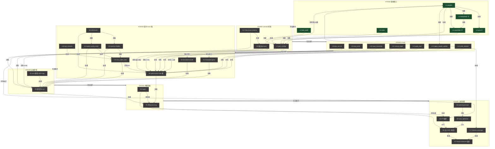

# Ladder-Foundry 代号速查

## STAGE(构建阶段 · 7)
- **STAGE1** 数据核心:L1/L2 + 三权重 L3/L4/L5 + L6(本地 pytest)
- **STAGE2** persona 内核:D1/D2/L7(首次产出完整 sim persona)
- **STAGE3** 9 leaf 脚本:L8–L14(本地 pytest)
- **STAGE4** 契约+loss+脑:L15/L16 + S1–S6(本地文本验)
- **STAGE5** 远端环境:R1/R3(首次三层 CC 真嵌套,Plan A)
- **STAGE6** 单题阶梯:D3占位 + R4(首条真阶梯)
- **STAGE7** 全机收敛:D3满 + D4 + R2/R5/R6/R7 + L17(Plan C)

## L(数据派内核 + 9 leaf 脚本 · 17)
- **L1** `weights.py` — 权重数据核心(4 段 schema,revise 守白名单)
- **L2** `leak_audit.py` — W5 检测签名词拦截
- **L3** `axes.py` ① — 纯读 axis_prose 出档位话术
- **L4** `interpolator.py` ② — 纯读 interp_params 出 6-rung 铺陈
- **L5** `assembler.py` ③ — 纯读 assembler_params 组装坐标卡
- **L6** `cards.py` — PolicyCard 序列化
- **L7** `gen_configs.py` — 生成管线,出 48(本地 6)config persona
- **L8** `new_run_id.py` — run_id + runs/ 骨架
- **L9** `trace_emit.py` — 11 事件账本追加
- **L10** `save_transcript.py` — 从 exec jsonl 提 transcript(--logs-dir 必填)
- **L11** `concat_triple.py` — fence 切块拼三元组(契约源)
- **L12** `gate_eval.py` — 闸门纯算术(三路 AND/pass_ratio/converged)
- **L13** `apply_weight_update.py` — 改一段权重(F2)/逐字节复制(F1)
- **L14** `write_dataset.py` — 白名单落数据集(label=生成条件)
- **L15** `run_codex_loss.py` — 起 codex 算 loss-1/loss-2
- **L16** `schemas/loss1.json+loss2.json` — loss 输出 schema
- **L17** `freeze.py+coverage_report.py` — 冻结权重 + 生成侧报告

## S(skill · 6)
- **S1** `formated-specs` — exec 末轮产 research-graph fence(待建)
- **S2** `formated-results` — exec 末轮产 research-result fence(待建)
- **S3** `injection-fidelity` — codex loss-1,判注入保真(check-blind)
- **S4** `ladder-quality-order` — codex loss-2,判阶梯单调 τ(check-blind)
- **S5** `optimization-loop` — optimizer 脑,§loop/gate/backprop/state/tools
- **S6** `references` — gate-thresholds + backprop-heuristic

## D(persona/数据 · 4)
- **D1** PolicyCard schema — F0–F9 + 5 轴{A1–A5}+B1 语义
- **D2** 2 端点 persona — id0 天才 / idN-1 抬杠(喂 ① 默认值)
- **D3** `topics.json` — 研究对象(STAGE6 占位1,STAGE7 满8)
- **D4** `optimizer-opening-prompt.txt` — optimizer 起跑令

## R(远端环境+运行 · 7)
- **R1** env/config-dir/skill-copy — 四身份可起+两组key隔离
- **R2** `start_optimizer.sh` — tmux 点火+readiness探针
- **R3** 竖切片 1-run e2e — 首次真嵌套(A E1–E5)
- **R4** 单topic 6-rung e2e — 首条真阶梯(B7)
- **R5** PT5 试点硬门 — AS-1端点分离+AS-4铺陈可训(C1)
- **R6** 全LOOP-2 收敛 — backprop真验,连3batch(C2)
- **R7** freeze+dataset+监督 — frozen+全标签集+HALT(C3/C4)

## 关系图

