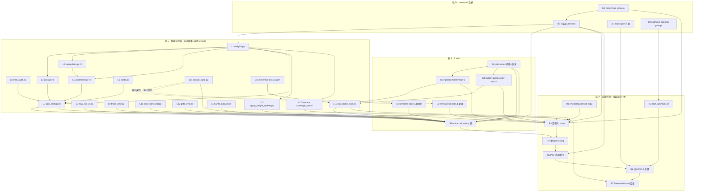
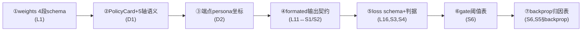
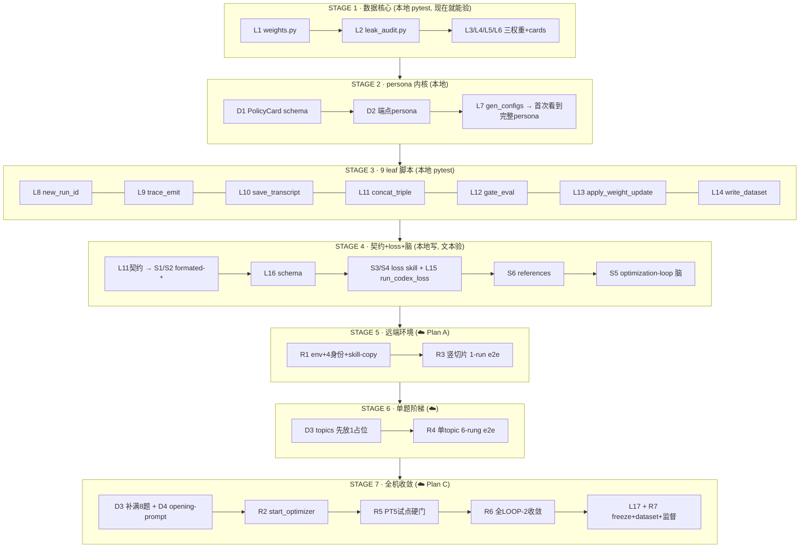

# Ladder-Foundry — 实现蓝图

> 项目:`ladder-foundry`(原 "triple-cc")。职能 = 锻造一条带标签、单调 good→bad 的研究样本**阶梯**,label = 生成条件(PolicyCard),绕开 no-ground-truth。
> 设计权威:`D:\YOGSOTH-AI\context\self-iteration\2026-06-07-triple-cc-system\` 的设计稿 + A/B/C 三计划。
> 本文目的:把"要造哪些零件、谁依赖谁、先设计谁、先实现谁"画清楚,供一块一块地造→单独验→最后组装。

---

## 0. 一句话架构

三层 CC 当 train.py:**optimizer(tmux 常驻)→ sim(每 run 新生,扮演带督导压力的用户)→ exec(每 run 新生,跑 DARE 研究)**,codex 当 loss(换模型族)。一 batch = 8 topic × 6 rung = 48 run;连续 3 batch pass_ratio≥80% 即收敛。三个可训练权重是 JSON 数据段(改 JSON 不改 .py);`frozen_label`(名次+坐标)锁死。

**sim 的 persona 就是 research_config(PolicyCard)**,由三权重生成。6 个 rung = 同一 topic 上从"天才用户"(id0)到"荒谬抬杠用户"(id5)的 6 张梯度 persona;它们对 exec 施加不同强度的督导压力,逼出不同质量的研究 → 阶梯。**每个样本的 label = 哪张 persona 生成的它**(是因,不是对果的质量评判)—— 这是绕开 no-ground-truth 的根。

---

## 1. 组件总清单(31 件)

**运行地点**:🖥️=Windows 本地可跑(纯函数/pytest,现在就能验)· ✍️=本地可写、语义可自查、真验要远端 · ☁️=只能远端(真 CC 嵌套)。
**状态**:🆕 全新建 · ⚠️ 计划假设其"已存在"但实为待建(formated-* 已核实)。

### 轨 L —— 数据派内核 + 9 leaf 脚本(🖥️ 纯函数,本地 pytest)

| # | 组件 | 类型 | 依赖 | 单独验收(跑了看什么) |
| --- | --- | --- | --- | --- |
| L1 | `generator/weights.py` | 数据核心 | — | 4 段 schema;revise 拒 frozen_label/非法 target;collision 只收 B1/expression;dump_initial 出 batch-0 |
| L2 | `generator/leak_audit.py` | W5 拦截 | — | 干净文本过、命中检测签名词 raise LeakHit |
| L3 | `generator/axes.py` ① | 纯读权重 | L1 | level_text(axis,level) 查 axis_prose 表 |
| L4 | `generator/interpolator.py` ② | 纯读权重 | L1 | ladder_levels(n=6) 出 6 rung;方向锁 id0..id5;offset 只 B1/expression |
| L5 | `generator/assembler.py` ③ | 纯读权重 | L1,L4 | build_batch 出 6 卡;扰动落点恒非 A1–A5 |
| L6 | `generator/cards.py` | 序列化 | — | to_dict 出 F0–F9 + axis_levels |
| L7 | `scripts/gen_configs.py` | 生成管线 | L1,L3,L4,L5,L6,L2 | **首次看到完整 sim persona**:6 个 config JSON 落盘 + 命名 `<batch>-topic<NN>-id<N>` |
| L8 | `scripts/new_run_id.py` | run 骨架 | — | 出 yyyy-mm-dd-hh-mm-ss + 建 runs/<id>/ 子目录 |
| L9 | `scripts/trace_emit.py` | 11 事件账本 | — | 追加一行 jsonl;7 公共字段 + seq 自增 + 事件体 |
| L10 | `scripts/save_transcript.py` | 落 transcript | — | --logs-dir 必填(缺则硬失败);只取 user/assistant |
| L11 | `scripts/concat_triple.py` | 拼三元组 | — | fence 切 graph/result;同名取最后一个;payload JSON |
| L12 | `scripts/gate_eval.py` | 闸门算术 | — | 三路 AND / pass_ratio(≥7/8) / converged(末3≥0.8) |
| L13 | `scripts/apply_weight_update.py` | 改权重 | L1 | F2 改一段+写 revision_log;F1 --copy 逐字节复制(不写 log) |
| L14 | `scripts/write_dataset.py` | 落数据集 | — | 白名单外字段→硬失败;label=生成条件 |
| L15 | `scripts/run_codex_loss.py` | 起 codex 算 loss | S3,S4,L16 | 注入整篇 SKILL.md + payload;--output-schema 约束 |
| L16 | `schemas/loss1.json`+`loss2.json` | 输出 schema | — | JSON Schema,字段对齐 loss skill OUTPUT 段 |
| L17 | `scripts/freeze.py`+`coverage_report.py` | 冻结+报告 | L1 | frozen.json;报告纯生成侧、无 log 路径、无 PG/NG |

### 轨 S —— 5 个 skill(✍️ 本地写,真验要远端;optimization-loop 真验在 C)

| # | 组件 | 类型 | 依赖 | 单独验收 |
| --- | --- | --- | --- | --- |
| S1 | `skills/formated-specs/` | 🆕⚠️ exec 产 graph | L11 契约 | 末轮产 ```research-graph fence + JSON(nodes/edges/layer/manifest/prereq_dag) |
| S2 | `skills/formated-results/` | 🆕⚠️ exec 产 result | L11 契约 | 末轮产 ```research-result fence + JSON(title/sections/artifacts) |
| S3 | `skills/injection-fidelity/` | 🆕 codex loss-1 | L16,S6 | 6 压力信号→轴期望带→AND 得 fidelity;过 leak_audit |
| S4 | `skills/ladder-quality-order/` | 🆕 codex loss-2 | L16,S6 | 6 件乱序→成对排名→τ + 端点分离;过 leak_audit |
| S5 | `skills/optimization-loop/` | 🆕 optimizer 脑 | 全部 L+S6+D2 | §loop/§gate/§backprop/§state/§tools 厚 skill |
| S6 | `references/gate-thresholds.md`+`backprop-heuristic.md` | 阈值+启发 | — | 阈值集中一处;backprop 归因表逐行 |

### 轨 D —— persona / 数据(✍️ 本地写)

| # | 组件 | 类型 | 依赖 | 单独验收 |
| --- | --- | --- | --- | --- |
| D1 | PolicyCard schema(F0–F9 + 轴定义) | 🆕 persona 骨 | — | 字段定义;轴 {A1–A5,B1} 语义锁 |
| D2 | 2 端点 persona(id0 天才 / idN-1 荒谬抬杠) | 🆕 ① 种子 | D1 | 喂入 axis_prose 默认值;端点坐标拉够远 |
| D3 | `config/topics.json`(8 真前沿 topic) | 🆕 研究对象 | — | 8 条 schema + check-blind;外部 DL 现象 + 争议 F7 |
| D4 | `ops/optimizer-opening-prompt.txt` | 🆕 起跑令 | S5 | 身份+纪律;无 -p/--resume/--session-id/--allowedTools |

### 轨 R —— 远端环境 + 组装运行(☁️ Plan A + C)

| # | 组件 | 类型 | 依赖 | 单独验收 |
| --- | --- | --- | --- | --- |
| R1 | env.sh / bootstrap.sh / 4 config-dir / 4 cwd / skill-copy | 🆕 环境 | — | 四身份可起;两组 key 隔离;重启可恢复(A S1–S4) |
| R2 | `ops/start_optimizer.sh` | 🆕 点火 | D4,R1 | tmux 起 optimizer + readiness 探针 + 送 prompt |
| R3 | 竖切片 1-run e2e | ☁️ 首次真嵌套 | L7-L16,S1-S4,D1-D2,R1 | optim→sim→exec 真跑通 + 真 loss + trace(A E1–E5) |
| R4 | 单 topic 6-rung e2e | ☁️ 首条阶梯 | R3,S5 | loss-2 τ + 端点分离 + gate 算术(B7) |
| R5 | PT5 试点硬门 | ☁️ go/no-go | R4,D2 | AS-1 端点能否拉开 + AS-4 改铺陈能否动 loss-2(C1) |
| R6 | 全 LOOP-2 收敛 | ☁️ backprop 真验 | R5 | ≥1 次 F2 真改权重 + ≥1 次 F1 复制 + 连 3 batch 收敛(C2) |
| R7 | freeze + dataset + 监督 | ☁️ 收尾 | R6,L17 | frozen.json + 全标签 dataset + HALT 可定位(C3/C4) |

---

## 2. 依赖关系图(谁需要谁)



**读图要点**:`L1 weights.py` 是整个数据派的根(三权重 + 改权重 + 冻结都依赖它);`D1→D2→L1` 表示 persona 骨架定义先于端点 persona,端点 persona 喂进 weights 的默认值(batch-0 由 dump_initial 导出);`L11 concat_triple` 与 `S1/S2 formated-*` 是**虚线契约关系**(concat 按 fence 切块,formated-* 必须产出那个 fence,二者靠契约而非代码耦合);`S5 optimization-loop` 汇聚所有 leaf + persona + references = 系统的脑;轨 R 全是远端真跑,逐级 e2e 加深(1-run→6-rung→试点→收敛→冻结)。

---

## 3. ⚠️ 蓝图揭出的真缺口(计划与设计稿冲突,以设计稿为准)

| 缺口 | 计划怎么说 | 实情(已核实) | 蓝图裁决 |
| --- | --- | --- | --- |
| formated-specs/results | Plan B:"已存在,只对接契约" | repo 无 `formated-*`,只有 `writing-specs`;老 probe-pretrain 有概念版(不继承代码) | **S1/S2 列为待建组件**,设计稿 L891 为准。它们是 exec 产 graph/result 的两个新 skill,是 R3 竖切片的前置 |
| 输出契约谁先定 | 分散在设计稿 concat 段 | L11 concat 的 fence 切块规则 = S1/S2 的硬契约 | 先定 L11 的契约(4 条:双 JSON + fence info-string + 原子性 + 取最后),S1/S2 照此产出 |

---

## 4. 设计顺序 vs 实现顺序(两者不同)

**设计顺序**(先把"契约/schema/语义"敲死,后写代码)——这些是"想清楚再动手"的:



**实现顺序**(自底向上,每层 green 再上;= Plan A→B→C 的细化)——下节清单。

---

## 5. 实现顺序(一块块造→单独验→组装)

把 31 件排成 7 个 STAGE。**STAGE 1–4 全在 Windows 本地就能造+验**(纯函数 pytest + skill 文本 + leak_audit 自查),不碰远端、不烧 token、不需要 key;**STAGE 5–7 才上远端**(真 CC 嵌套)。我们就按这个顺序一块块来。



### 每个 STAGE 的"单独运行查看效果"方式

| STAGE | 造什么 | 怎么单独验(满意才进下一块) | 在哪跑 |
| --- | --- | --- | --- |
| 1 | L1,L2,L3,L4,L5,L6 | `pytest tests/` 全绿:schema 4 段、revise 拒锁段、collision 只 B1/expression、6-rung 方向锁、扰动不碰 A1–A5 | 🖥️本地 |
| 2 | D1,D2,L7 | 跑 `gen_configs.py` 出 6 个 config JSON,**人眼读**:id0 像天才用户、id5 像抬杠用户、命名对、过 leak_audit | 🖥️本地 |
| 3 | L8–L14 | 每个脚本一个 pytest:run_id 格式+建骨架、trace 11 事件 seq 自增、save_transcript --logs-dir 必填、concat fence 取最后、gate 三路算术、apply F1/F2、write_dataset 白名单硬失败 | 🖥️本地 |
| 4 | S1,S2,L16,S3,S4,L15,S6,S5 | skill 文本写完跑 leak_audit 全 CLEAN;schema 用 jsonschema 自校;S5 厚 skill §loop/§gate/§backprop/§state/§tools 齐 | 🖥️本地(真 loss 留到 ST5) |
| 5 | R1,R3 | 远端:四身份各回 OK、skill 可见、重启后仍绿;**竖切片**真 optim→sim→exec→codex 跑通 1 run,trace/transcript/triple/loss1 落盘 + NO LEAK | ☁️远端 |
| 6 | R4(D3 先 1 占位题) | 单 topic 6 rung 真跑通:loss-2 出 τ、端点分离、gate 出 topic_pass | ☁️远端 |
| 7 | D3 补满,D4,R2,R5,R6,L17,R7 | PT5 硬门 go/no-go;全 LOOP-2 真收敛(≥1 F2 改权重 + ≥1 F1 复制);freeze + dataset + HALT 可定位 | ☁️远端 |

### 关键里程碑(三个"第一次看到")

1. **STAGE 2 末:第一次看到完整 sim persona** —— gen_configs 出的 6 张卡就是 disc#22 说的那条 persona 阶梯。这是离你脑中设计最近的一块,值得在这里停下来仔细对。
2. **STAGE 5 末:第一次看到三层 CC 真嵌套跑通** —— 竖切片证明 optim→sim→exec 机制成立,1 run 端到端。
3. **STAGE 6 末:第一次看到一条真阶梯** —— loss-2 的 τ 第一次量出"质量是否随 rung 单调下降"。

---

## 6. 下一步

蓝图 design-complete。建议从 **STAGE 1 · L1 `weights.py`** 起步(数据派的根,纯函数,本地 pytest,TDD 红→绿)。每块造完单独跑给你看,满意再进下一块。

> 全程铁律(每块都守):无 `-p/--resume/--session-id/--allowedTools`;子 CC 父 CC 直起、无 driver/PTY;三权重改 JSON 不改 .py;frozen_label 锁死;扰动只 B1/expression;W5 check-blind;隐私红线;从零写不继承老 probe-pretrain;Write/Edit <13000。

