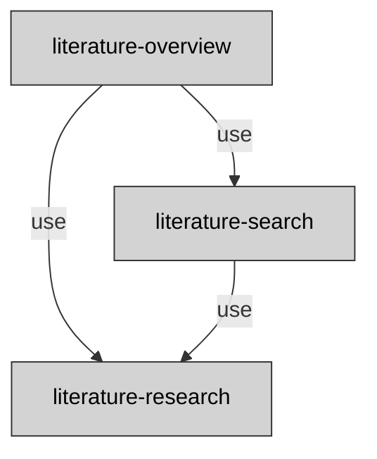

# literature-engine — use-dependency graph

```mermaid
flowchart TD
    literature-overview["literature-overview"]
    literature-search["literature-search"]
    literature-research["literature-research"]

    literature-overview -->|use| literature-search
    literature-overview -->|use| literature-research
    literature-search -->|use| literature-research

    classDef campaign fill:#ff8c42,stroke:#333,color:#000;
    classDef strategy fill:#4ecdc4,stroke:#333,color:#000;
    classDef tactic fill:#95e1a3,stroke:#333,color:#000;
    classDef sop fill:#d3d3d3,stroke:#333,color:#000;
    classDef references fill:#f5f5f5,stroke:#999,stroke-dasharray:5 5,color:#000;

    class literature-overview sop;
    class literature-search sop;
    class literature-research sop;
```
