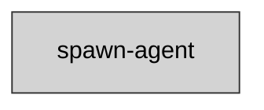

# subagent-spawning — use-dependency graph

```mermaid
flowchart TD
    spawn-agent["spawn-agent"]

    classDef campaign fill:#ff8c42,stroke:#333,color:#000;
    classDef strategy fill:#4ecdc4,stroke:#333,color:#000;
    classDef tactic fill:#95e1a3,stroke:#333,color:#000;
    classDef sop fill:#d3d3d3,stroke:#333,color:#000;
    classDef references fill:#f5f5f5,stroke:#999,stroke-dasharray:5 5,color:#000;

    class spawn-agent sop;
```
