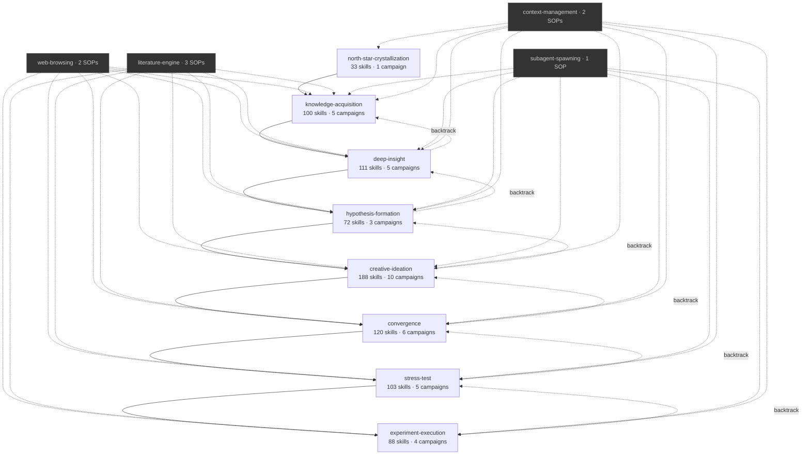

# Skill Index

Complete capability map of the De-Anthropocentric Research Engine.

## Pipeline Panorama

## Research Phase Summary

| Phase | Repo | Role | Campaigns | Total Skills | Pre-condition |
|-------|------|------|-----------|-------------|---------------|
| 1 | north-star-crystallization | Crystallize research direction | north-star-crystallization | 33 | None |
| 2 | knowledge-acquisition | Systematic knowledge gathering | literature-survey, patent-mining, benchmark-archaeology, meta-analysis, baseline-establishment | 100 | North Star |
| 3 | deep-insight | Deep analysis & root causes | gap-analysis, insight, boundary-analysis, sensitivity-analysis, problem-reformulation | 111 | North Star + findings |
| 4 | hypothesis-formation | Hypotheses & research questions | gap-prioritization, hypothesis-formulation, research-question | 72 | North Star + gaps |
| 5 | creative-ideation | Divergent idea generation | structural-deconstruction, cross-domain-discovery, assumption-destruction, biomimicry, synectics, morphological-exploration, lateral-thinking, combinatorial-creativity, perspective-forcing, systematic-enumeration | 188 | Hypothesis |
| 6 | convergence | Selection & ranking | multi-criteria-scoring, pairwise-ranking, structured-consensus, feasibility-assessment, portfolio-optimization, steel-manning | 120 | Candidates |
| 7 | stress-test | Adversarial validation | multiagent-debate, red-teaming, failure-anticipation, counterfactual-probing, adversarial-stress-testing | 103 | Artifact |
| 8 | experiment-execution | Experiment design & execution | experiment-design, constraint-analysis, scenario-planning, implementation-planning | 88 | Validated approach |

## Infrastructure SOPs

| Repo | Skills | Purpose |
|------|--------|---------|
| web-browsing | web-search, web-research | Web search (snippets) + full-page reading (apify) |
| literature-engine | literature-overview, literature-search, literature-research | Paper scanning / AI-summary / full-text reading |
| subagent-spawning | spawn-agent | Dispatch parallel research subagents |
| context-management | context-init, context-checkpoint | Session state persistence (≥500 lines per checkpoint) |

## Drill-Down

To explore a specific phase's complete 4-layer hierarchy (campaign → strategy → tactic → SOP), Read the corresponding reference file:

| Phase | Reference File |
|-------|---------------|
| north-star-crystallization | `reference/north-star-crystallization-index.md` |
| knowledge-acquisition | `reference/knowledge-acquisition-index.md` |
| deep-insight | `reference/deep-insight-index.md` |
| hypothesis-formation | `reference/hypothesis-formation-index.md` |
| creative-ideation | `reference/creative-ideation-index.md` |
| convergence | `reference/convergence-index.md` |
| stress-test | `reference/stress-test-index.md` |
| experiment-execution | `reference/experiment-execution-index.md` |

Read the reference file for any phase you need to understand in detail before routing or spec generation.
