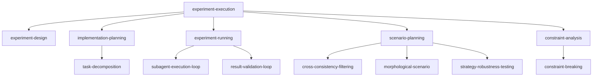

# Experiment Execution — Skill Hierarchy

## Hierarchy

## Complete Skill Table

| Level | Skill | Description |
|-------|-------|-------------|
| campaign | experiment-execution | Transform hypotheses into executable experiments |
| strategy | experiment-design | Transform hypotheses into rigorous designs |
| strategy | implementation-planning | Plan execution path, produce executable plan |
| strategy | experiment-running | Dispatch subagents, monitor, collect results |
| strategy | scenario-planning | Construct future scenarios, assess robustness |
| strategy | constraint-analysis | Identify bottlenecks, quantify constraints |
| tactic | task-decomposition | Break design into sequenced, estimated tasks |
| tactic | subagent-execution-loop | Orchestrate execution via fresh subagents |
| tactic | result-validation-loop | Validate via stats, ROPE, reproducibility |
| tactic | cross-consistency-filtering | Pairwise consistency + narrative filtering |
| tactic | morphological-scenario | Zwicky Box + CCA for scenario enumeration |
| tactic | strategy-robustness-testing | Impact assessment + robustness scoring |
| tactic | constraint-breaking | Extract conflict, challenge, project resolution |
| sop | ablation-component-mapping | Map architecture to ablatable units |
| sop | ablation-design | Design ablation studies for ML systems |
| sop | activity-listing | Enumerate all implementation activities |
| sop | assumption-challenging | Challenge each assumption's validity |
| sop | assumption-constraint | Vulnerability ranking of assumptions |
| sop | baseline-selection | Select appropriate comparison baselines |
| sop | bottleneck-identification | Identify bottleneck dimensions |
| sop | budget-constrained-design | Optimize design under budget constraints |
| sop | buffer-sizing | Calculate project/feeding/resource buffers |
| sop | causal-chain-tracing | Trace UDE to root cause via IF-THEN |
| sop | checkpoint-and-recover | Checkpoint state, detect anomalies, recover |
| sop | comparison-design | Design fair comparison experiments |
| sop | competitive-move-prediction | Predict competitor progress/publications |
| sop | competitive-scenario | Competitive method progress prediction |
| sop | conflict-resolution | Evaporating Cloud + assumption challenging |
| sop | consistency-pair-evaluation | Evaluate pairwise value consistency |
| sop | constraint-synthesis | Synthesize constraint analysis report |
| sop | constraint-tree-building | Build Current Reality Tree from UDEs |
| sop | core-conflict-extraction | Extract conflict in EC format (A-B-C-D-D') |
| sop | critical-chain-identification | Longest path with resource contention |
| sop | critical-path-calculation | CPM forward/backward pass with float |
| sop | critical-path-planning | Shortest path via CPM + buffer insertion |
| sop | dependency-constraint | Dependency chain + prerequisite graph |
| sop | dependency-graph-construction | Build task dependency graph |
| sop | dependency-sequencing | Determine task execution order |
| sop | design-matrix-construction | Build experiment design matrix |
| sop | design-synthesis | Synthesize complete experiment design |
| sop | duration-estimation | Three-point PERT estimation |
| sop | environment-specification | Define experiment environment spec |
| sop | execution-monitoring | Monitor progress, detect anomalies |
| sop | execution-synthesis | Synthesize complete execution report |
| sop | experiment-config-generation | Generate executable config files |
| sop | factor-identification | Identify IV, DV, and control variables |
| sop | factor-level-design | Identify factors and levels |
| sop | future-reality-projection | Project effects via Future Reality Tree |
| sop | implementer-dispatch | Dispatch execution subagent by complexity |
| sop | intermediate-objective-design | Design objectives to overcome obstacles |
| sop | level-specification | Determine appropriate factor levels |
| sop | metric-specification | Define metrics and significance standards |
| sop | narrative-scenario | Shell method narrative construction |
| sop | obstacle-identification | TOC Prerequisite Tree obstacle listing |
| sop | parameter-enumeration | Enumerate values per uncertainty driver |
| sop | parameter-space-construction | Build complete morphological field |
| sop | plan-formatting | Format as bite-sized executable tasks |
| sop | plan-writing | Format critical path into executable plan |
| sop | prerequisite-planning | Identify obstacles, design intermediates |
| sop | quality-gate-check | Format completeness and logic check |
| sop | reproducibility-protocol | Systematic environment and seed control |
| sop | reproducibility-verification | Verify via re-runs with different seeds |
| sop | resource-constraint | Quantify compute/data/time/human resources |
| sop | resource-quantification | Quantify demand vs supply vs gap |
| sop | result-analysis | Statistical analysis of collected results |
| sop | result-collection | Collect metrics, logs, artifacts |
| sop | robustness-design | Design experiments for failure boundaries |
| sop | robustness-scoring | Compute robustness index across scenarios |
| sop | sample-size-estimation | Power analysis and experiment count |
| sop | scaling-design | Design scaling experiments |
| sop | scenario-driver-identification | PESTEL framework uncertainty drivers |
| sop | scenario-impact-assessment | Assess scenario impact on approach |
| sop | scenario-narrative-construction | Build rich narratives per configuration |
| sop | scenario-synthesis | Comprehensive scenario analysis report |
| sop | seed-protocol-design | Design random seed strategy |
| sop | sensitivity-ranking | Rank constraints by sensitivity |
| sop | statistical-method-selection | Select appropriate statistical methods |
| sop | statistical-testing | Bootstrap/permutation/Bayesian ROPE tests |
| sop | stress-scenario | Extreme condition + failure mode enum |
| sop | temporal-scenario | Short/medium/long-term timeline projection |
| sop | timeline-projection | Extrapolate landscape timelines |
| sop | undesirable-effect-listing | List current UDEs |
| sop | worst-case-construction | Construct extreme worst-case scenarios |
| sop | saturation-detection | Determine diminishing returns threshold |
| sop (import) | web-search | Quick web scanning for landscape |
| sop (import) | web-research | Full-page web reading |
| sop (import) | paper-overview | Abstract-level paper scanning |
| sop (import) | paper-search | AI-summarized paper reading |
| sop (import) | paper-research | Full-depth paper reading |
