# Hypothesis Formation — Skill Hierarchy

## Hierarchy

```mermaid
graph TD
    C1[hypothesis-formulation]
    C2[research-question]

    S1[deductive-hypothesis-generation]
    S2[inductive-hypothesis-generation]
    S3[abductive-hypothesis-generation]
    S4[competing-hypothesis-construction]
    S5[hypothesis-operationalization]
    C1 --> S1 & S2 & S3 & S4 & S5

    S6[framework-guided-formulation]
    S7[decomposition-formulation]
    S8[comparative-formulation]
    S9[feasibility-constrained-formulation]
    S10[scope-calibration]
    C2 --> S6 & S7 & S8 & S9 & S10

    T1[theory-mechanism-extraction]
    T2[anomaly-driven-abduction]
    T3[falsifiability-audit]
    T4[competing-hypothesis-matrix]
    C1 --> T1 & T2 & T3 & T4

    T5[framework-selection-and-application]
    T6[sub-question-decomposition]
    T7[question-refinement-loop]
    T8[pairwise-comparison]
    T9[scoring-matrix-construction]
    T10[priority-sensitivity-testing]
    C2 --> T5 & T6 & T7 & T8 & T9 & T10

    S11[rapid-triage]
    S12[multi-criteria-ranking]
    S13[evidence-based-prioritization]
    S14[stakeholder-weighted-ranking]
    S15[portfolio-optimization]
    C2 --> S11 & S12 & S13 & S14 & S15
```

## Complete Skill Table

| Level | Skill | Description |
|-------|-------|-------------|
| campaign | hypothesis-formulation | Turn insights/gaps into testable hypotheses |
| campaign | research-question | Refine hypotheses into precise questions |
| strategy | deductive-hypothesis-generation | Derive hypotheses from existing theory |
| strategy | inductive-hypothesis-generation | Induce hypotheses from data/observations |
| strategy | abductive-hypothesis-generation | Inference to best explanation for anomalies |
| strategy | competing-hypothesis-construction | Construct multiple competing hypotheses |
| strategy | hypothesis-operationalization | Refine hypothesis into testable form |
| strategy | framework-guided-formulation | Apply PICO/SPIDER/SPICE/ECLIPSE framework |
| strategy | decomposition-formulation | Decompose complex question into sub-questions |
| strategy | comparative-formulation | Construct systematic A vs B comparison |
| strategy | feasibility-constrained-formulation | Reframe question under resource constraints |
| strategy | scope-calibration | Adjust question scope until appropriate |
| strategy | rapid-triage | Fast coarse filtering to compress gap set |
| strategy | multi-criteria-ranking | Weighted scoring to rank gaps |
| strategy | evidence-based-prioritization | AHRQ PiCMe evidence-driven prioritization |
| strategy | stakeholder-weighted-ranking | Weight rankings by stakeholder perspective |
| strategy | portfolio-optimization | Optimize gap set as investment portfolio |
| tactic | theory-mechanism-extraction | Theory to mechanisms to hypotheses |
| tactic | anomaly-driven-abduction | Describe anomaly, generate explanations, rank |
| tactic | falsifiability-audit | Test falsifiability, repair, operationalize |
| tactic | competing-hypothesis-matrix | Multi-hypothesis comparison matrix |
| tactic | framework-selection-and-application | Select and apply research-question framework |
| tactic | sub-question-decomposition | Decompose into answerable sub-questions |
| tactic | question-refinement-loop | Iterate until FINER criteria pass |
| tactic | pairwise-comparison | Rank gaps via relative comparison |
| tactic | scoring-matrix-construction | Build comprehensive evaluation matrix |
| tactic | priority-sensitivity-testing | Perturb weights to test ranking stability |
| sop | theory-identification | Identify relevant theoretical frameworks |
| sop | mechanism-extraction | Extract causal mechanism chain from theory |
| sop | variable-identification | Identify variables and roles in hypothesis |
| sop | relationship-specification | Specify direction/form of relationships |
| sop | boundary-condition-specification | Specify conditions under which hypothesis holds |
| sop | anomaly-characterization | Describe/classify anomalous phenomena |
| sop | explanation-generation | Generate candidate explanations |
| sop | plausibility-ranking | Rank explanations by weighted plausibility |
| sop | competing-hypothesis-generation | Generate mechanism-level competing hypotheses |
| sop | discriminating-prediction-design | Design predictions distinguishing hypotheses |
| sop | hypothesis-comparison-matrix | Build multi-dimensional comparison matrix |
| sop | falsifiability-check | Check if hypothesis meets falsifiability |
| sop | operationalization | Abstract concepts to measurable indicators |
| sop | hypothesis-synthesis | Synthesize into final hypothesis set |
| sop | framework-matching | Match framework to study type |
| sop | pico-application | Apply PICO/PICOTS framework |
| sop | spider-application | Apply SPIDER for qualitative questions |
| sop | spice-application | Apply SPICE for evaluative questions |
| sop | eclipse-application | Apply ECLIPSE for mixed-method questions |
| sop | sub-question-generation | Decompose into sub-questions |
| sop | answering-sequence-design | Design optimal answer order |
| sop | dependency-mapping | Map sub-question dependencies |
| sop | finer-criteria-check | Evaluate against 5 FINER criteria |
| sop | scope-assessment | Assess scope appropriateness |
| sop | success-criteria-definition | Define measurable success criteria |
| sop | question-synthesis | Synthesize final research question set |
| sop | gap-normalization | Normalize gaps to standard GapRecord |
| sop | gap-pairwise-judgment | Compare two gaps criterion by criterion |
| sop | ahp-weighting | AHP to determine criterion weights |
| sop | consistency-check | Check pairwise judgment consistency |
| sop | importance-scoring | Evaluate academic/practical importance |
| sop | novelty-scoring | Assess novelty potential of gap |
| sop | feasibility-scoring | Evaluate gap attackability |
| sop | impact-scoring | Evaluate potential impact of gap |
| sop | ahrq-picme-assessment | AHRQ PiCMe 6-dimension evaluation |
| sop | weight-perturbation | Perturb weights, test ranking stability |
| sop | priority-synthesis | Final prioritized gap list |
| sop | quality-gate-check | Format completeness and logic check |
| sop | gap-prioritization | Score/rank gaps multi-criteria |
| sop | saturation-detection | Determine diminishing returns threshold |
| sop (import) | web-search | Quick web scanning for landscape |
| sop (import) | web-research | Full-page web reading |
| sop (import) | paper-overview | Abstract-level paper scanning |
| sop (import) | paper-search | AI-summarized paper reading |
| sop (import) | paper-research | Full-depth paper reading |
