# Knowledge Acquisition — Skill Hierarchy

## Hierarchy

```mermaid
graph TD
    C1[literature-survey]
    C2[patent-mining]
    C3[benchmark-archaeology]
    C4[baseline-establishment]
    C5[meta-analysis]

    S1[scoping-survey]
    S2[systematic-survey]
    S3[deep-survey]
    S4[narrative-review]
    S5[snowball]
    C1 --> S1 & S2 & S3 & S4 & S5

    S6[landscape-survey]
    S7[prior-art-search]
    S8[white-space-analysis]
    S9[competitive-intelligence]
    S10[claim-analysis]
    C2 --> S6 & S7 & S8 & S9 & S10

    S11[benchmark-audit]
    S12[saturation-analysis]
    S13[validity-probing]
    S14[coverage-mapping]
    S15[protocol-forensics]
    C3 --> S11 & S12 & S13 & S14 & S15

    S16[method-discovery]
    S17[method-inventory]
    S18[performance-extraction]
    S19[condition-standardization]
    S20[progress-quantification]
    C4 --> S16 & S17 & S18 & S19 & S20

    S21[pairwise-synthesis]
    S22[network-comparison]
    S23[cumulative-tracking]
    S24[heterogeneity-investigation]
    S25[bias-detection]
    C5 --> S21 & S22 & S23 & S24 & S25

    T1[prisma-screening]
    T2[citation-chaining]
    T3[narrative-framing]
    S2 --> T1 & T2
    S5 --> T2

    T4[patent-family-tracing]
    T5[classification-navigation]
    T6[claim-decomposition]
    C2 --> T4 & T5 & T6

    T7[score-trajectory-analysis]
    T8[artifact-detection]
    T9[evaluation-protocol-comparison]
    C3 --> T7 & T8 & T9
```

## Complete Skill Table

| Level | Skill | Description |
|-------|-------|-------------|
| campaign | literature-survey | 5 survey paradigms with budget enforcement |
| campaign | patent-mining | 5 strategies for patent landscape analysis |
| campaign | benchmark-archaeology | 5 strategies for benchmark/metric analysis |
| campaign | baseline-establishment | SOTA performance baseline collection |
| campaign | meta-analysis | Cross-study statistical synthesis planning |
| strategy | scoping-survey | Broad landscape mapping, breadth over depth |
| strategy | systematic-survey | Exhaustive PRISMA-style coverage |
| strategy | deep-survey | Precise targeted sub-problem investigation |
| strategy | narrative-review | Theory-driven review for arguments |
| strategy | snowball | Citation-chain-driven from seed papers |
| strategy | landscape-survey | Patent domain full-scan via assignee/IPC |
| strategy | prior-art-search | Novelty evaluation, find relevant prior art |
| strategy | white-space-analysis | Patent coverage gap identification |
| strategy | competitive-intelligence | Competitor IP portfolio analysis |
| strategy | claim-analysis | Deep claim scope decomposition |
| strategy | benchmark-audit | BetterBench 46-criterion quality assessment |
| strategy | saturation-analysis | Score trajectory and saturation detection |
| strategy | validity-probing | Construct validity challenge |
| strategy | coverage-mapping | Evaluation coverage gap identification |
| strategy | protocol-forensics | Protocol difference analysis across papers |
| strategy | method-discovery | Identify all relevant methods via literature |
| strategy | method-inventory | Comprehensive method identification |
| strategy | performance-extraction | Extract performance data from papers |
| strategy | condition-standardization | Standardize evaluation conditions |
| strategy | progress-quantification | Track performance progress over time |
| strategy | pairwise-synthesis | Paired meta-analysis protocol design |
| strategy | network-comparison | N-method network meta-analysis protocol |
| strategy | cumulative-tracking | Cumulative meta-analysis protocol |
| strategy | heterogeneity-investigation | Explain inter-study differences |
| strategy | bias-detection | Publication/reporting bias assessment |
| tactic | prisma-screening | Multi-stage PRISMA screening funnel |
| tactic | citation-chaining | Forward/backward citation tracing |
| tactic | narrative-framing | Theory-driven reading framework |
| tactic | patent-family-tracing | Patent citation and priority tracing |
| tactic | classification-navigation | IPC/CPC hierarchy drill-down |
| tactic | claim-decomposition | Claim parsing and feature mapping |
| tactic | score-trajectory-analysis | Historical scores, saturation curves |
| tactic | artifact-detection | Annotation artifacts and shortcuts |
| tactic | evaluation-protocol-comparison | Protocol differences across papers |
| sop | survey-synthesis | Weave evidence into structured output |
| sop | define-search-protocol | Formalize queries and inclusion criteria |
| sop | categorize-papers | Cluster papers by theme/method/timeline |
| sop | extract-data | Structured data extraction from papers |
| sop | quality-assessment | Methodological rigor scoring |
| sop | seed-selection | Validate starting papers for snowball |
| sop | saturation-detection | Determine diminishing returns threshold |
| sop | taxonomy-mapping | Construct hierarchical field map |
| sop | prisma-flowchart | PRISMA-compliant flow documentation |
| sop | thematic-coding | Identify recurring themes via coding |
| sop | gap-identification | Identify literature gaps and absences |
| sop | patent-query-formulation | Construct patent search strategies |
| sop | patent-categorization | Classify patents by subdomain |
| sop | assignee-normalization | Standardize assignee names |
| sop | citation-network-analysis | Build citation graphs, PageRank |
| sop | trend-analysis | Filing volume time-series, S-curve |
| sop | white-space-mapping | Feature cross-matrix blank areas |
| sop | claim-parsing | Claim syntax parsing, element extraction |
| sop | legal-status-assessment | Patent legal status determination |
| sop | quality-scoring | Multi-dimensional patent quality |
| sop | patent-synthesis | Final patent intelligence report |
| sop | benchmark-inventory | Catalog all relevant benchmarks |
| sop | metric-decomposition | Decompose composite metrics |
| sop | contamination-audit | Detect train-test data leakage |
| sop | construct-validity-assessment | Evaluate benchmark validity |
| sop | documentation-audit | Assess documentation completeness |
| sop | capability-taxonomy-mapping | Build capability taxonomy |
| sop | leaderboard-dynamics-analysis | Leaderboard score distributions |
| sop | leaderboard-harvesting | Collect performance data from platforms |
| sop | protocol-element-extraction | Extract evaluation protocol parameters |
| sop | reproducibility-checklist-audit | ML Reproducibility Checklist check |
| sop | score-extraction | Extract (Task,Dataset,Metric,Score) tuples |
| sop | baseline-synthesis | Final structured baseline report |
| sop | benchmark-synthesis | Final structured audit report |
| sop | compute-normalization | Normalize results by compute budget |
| sop | condition-cataloging | Record evaluation conditions from paper |
| sop | condition-normalization | Compare/standardize conditions |
| sop | discrepancy-analysis | Identify reported vs reproducible gaps |
| sop | discrepancy-identification | Flag significant score deviations |
| sop | headroom-estimation | Estimate ceiling vs current SOTA gap |
| sop | performance-table-assembly | Unified comparison table assembly |
| sop | progress-curve-construction | Build progress curves with inflections |
| sop | progress-curve-fitting | Performance-over-time visualization |
| sop | data-extraction-form | Design structured extraction form |
| sop | effect-size-extraction | Extract effect sizes from papers |
| sop | effect-size-planning | Determine effect size calculation methods |
| sop | evidence-network-construction | Build evidence network graph |
| sop | evidence-synthesis-planning | Plan statistical synthesis approach |
| sop | heterogeneity-source-analysis | Classify heterogeneity sources |
| sop | inclusion-criteria-design | Define inclusion/exclusion criteria |
| sop | meta-analysis-synthesis | Final PRISMA-compliant protocol |
| sop | pico-formulation | Construct PICO/PECO framework |
| sop | publication-bias-assessment | Plan funnel plots, Egger's test |
| sop | quality-assessment-protocol | Bias risk assessment via validated tools |
| sop | risk-of-bias-assessment | RoB2/PROBAST/QUADAS-2 assessment |
| sop | sensitivity-analysis-design | Design leave-one-out, subgroup analyses |
| sop (import) | web-search | Quick web scanning for landscape |
| sop (import) | web-research | Full-page web reading |
| sop (import) | paper-overview | Abstract-level paper scanning |
| sop (import) | paper-search | AI-summarized paper reading |
| sop (import) | paper-research | Full-depth paper reading |
