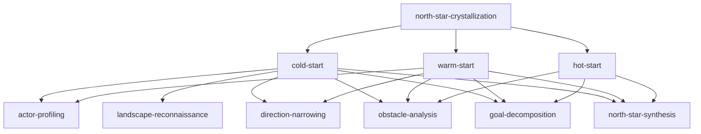

# North Star Crystallization — Skill Hierarchy

## Hierarchy

## Complete Skill Table

| Level | Skill | Description |
|-------|-------|-------------|
| campaign | north-star-crystallization | Crystallize fuzzy research intent into North Star + ResearchBrief |
| strategy | cold-start | Full crystallization from zero direction |
| strategy | warm-start | Simplified flow for general direction |
| strategy | hot-start | Rapid crystallization for specific topic |
| tactic | actor-profiling | Understand user background, resources, constraints |
| tactic | landscape-reconnaissance | Broad survey of potential research areas |
| tactic | direction-narrowing | Focus from broad area to specific problem |
| tactic | obstacle-analysis | Identify and assess obstacles to goals |
| tactic | goal-decomposition | Break research goals into sub-goals |
| tactic | north-star-synthesis | Converge into North Star + ResearchBrief |
| sop | ask-intentionality | Deep WHY probing via i* modeling |
| sop | explore-resume | Understand user background comprehensively |
| sop | ask-constraints | Understand hard boundaries on research |
| sop | clarify-resources | Understand available resources for research |
| sop | broad-paper-search | Paper landscape scan, >=80 papers |
| sop | broad-web-search | Quick web scanning, >=150 results |
| sop | deep-web-search | Full-page reading, >=30 pages |
| sop | generate-candidate-fields | Propose 3-8 candidate research fields |
| sop | landscape-synthesis | Evaluate fields on maturity/competition/barrier |
| sop | present-and-ask | Present panorama, gather user preferences |
| sop | present-candidates | Analyze and present ranked sub-directions |
| sop | identify-obstacles | Enumerate barriers to research direction |
| sop | assess-obstacle-severity | Rate obstacle difficulty and workarounds |
| sop | propose-mitigations | Search-validated mitigation strategies |
| sop | ask-obstacle-acceptance | Present obstacles for user acceptance |
| sop | formulate-top-goal | Express direction as formal goal statement |
| sop | and-or-decompose | KAOS-style recursive goal decomposition |
| sop | ask-decomposition-validation | Present GoalTree for user confirmation |
| sop | feasibility-check | Cross-reference GoalTree against constraints |
| sop | validate-leaves | Quality check on GoalTree leaf nodes |
| sop | crystallize-north-star | Fuse GoalTree + motivation into North Star |
| sop | generate-research-brief | Aggregate context into ResearchBrief |
| sop | final-validation | Self-review before presenting to user |
