# Stress Test — Skill Hierarchy

## Hierarchy

```mermaid
graph TD
    C1[multiagent-debate]
    C2[red-teaming]
    C3[failure-anticipation]
    C4[counterfactual-probing]
    C5[adversarial-stress-testing]

    S1[critic-defender-judge]
    S2[courtroom-structured]
    S3[society-of-mind]
    S4[adversarial-escalation]
    S5[adversarial-persona]
    S6[multi-perspective-panel]
    S7[groupthink-mitigation]
    C1 --> S1 & S2 & S3 & S4 & S5 & S6 & S7

    S8[systematic-probing]
    S9[alternative-analysis]
    C2 --> S8 & S9

    S10[prospective-hindsight]
    S11[design-fmea]
    S12[process-fmea]
    S13[risk-prioritization]
    S14[mitigation-design]
    C3 --> S10 & S11 & S12 & S13 & S14

    S15[structural-counterfactual]
    S16[factor-removal]
    S17[closest-worlds]
    S18[necessity-sufficiency]
    S19[thought-experiment]
    C4 --> S15 & S16 & S17 & S18 & S19

    T1[adversarial-roleplay]
    T2[evidence-tournament]
    T3[structured-attack-campaign]
    C2 --> T1 & T2 & T3

    T4[premortem-to-fmea-pipeline]
    T5[failure-chain-tracing]
    T6[mitigation-validation]
    C3 --> T4 & T5 & T6

    T7[assumption-cascade]
    T8[causal-necessity-testing]
    T9[minimal-change-search]
    T10[systematic-factor-ablation]
    C4 --> T7 & T8 & T9 & T10

    T11[boundary-probing]
    T12[counterexample-heuristics]
    T13[lakatos-heuristics]
    C5 --> T11 & T12 & T13
```

## Complete Skill Table

| Level | Skill | Description |
|-------|-------|-------------|
| campaign | multiagent-debate | Multi-agent structured adversarial debate |
| campaign | red-teaming | Systematic adversarial attack campaigns |
| campaign | failure-anticipation | Forward-looking failure analysis |
| campaign | counterfactual-probing | Identify load-bearing factors |
| campaign | adversarial-stress-testing | Logical extreme and boundary testing |
| strategy | critic-defender-judge | Classic triangular debate (Irving) |
| strategy | courtroom-structured | Legal adversarial structure |
| strategy | society-of-mind | Multi-agent collaborative debate (Du) |
| strategy | adversarial-escalation | Progressive pressure escalation |
| strategy | adversarial-persona | Role-play attacks from hostile personas |
| strategy | multi-perspective-panel | Multi-stakeholder review panel |
| strategy | groupthink-mitigation | 10th Man Rule, institutionalized dissent |
| strategy | systematic-probing | Enumerate surfaces, generate vectors, probe |
| strategy | alternative-analysis | What-If, Alternative Futures, Four Ways |
| strategy | prospective-hindsight | Klein pre-mortem, assume failure |
| strategy | design-fmea | Research design-level FMEA |
| strategy | process-fmea | Research execution process FMEA |
| strategy | risk-prioritization | RPN action priority per AIAG-VDA |
| strategy | mitigation-design | Prevention/detection/response measures |
| strategy | structural-counterfactual | Pearl Three-Step counterfactual |
| strategy | factor-removal | Systematic one-at-a-time removal |
| strategy | closest-worlds | Lewis minimal change to flip conclusion |
| strategy | necessity-sufficiency | PNS/PS for each factor |
| strategy | thought-experiment | Williamson precise thought experiments |
| tactic | adversarial-roleplay | Construct persona, attack from perspective |
| tactic | evidence-tournament | Evidence gathering, cross-exam, scoring |
| tactic | structured-attack-campaign | Full attack lifecycle |
| tactic | premortem-to-fmea-pipeline | Pre-mortem feeds into full FMEA |
| tactic | failure-chain-tracing | Trace upstream causes, downstream effects |
| tactic | mitigation-validation | Mini-FMEA on proposed mitigations |
| tactic | assumption-cascade | Attack root assumptions, trace cascade |
| tactic | causal-necessity-testing | Extract claims, evaluate PN/PS |
| tactic | minimal-change-search | Find flip-points, measure fragility |
| tactic | systematic-factor-ablation | Remove one at a time, rank importance |
| tactic | boundary-probing | Map parameters, test at boundaries |
| tactic | counterexample-heuristics | Generate monsters, bar, incorporate |
| tactic | lakatos-heuristics | Proofs and Refutations method |
| sop | debate-architect | Design debate structure and parameters |
| sop | debate-critic | Generate structured criticism (Toulmin) |
| sop | debate-defender | Respond with counter-evidence/rebuttal |
| sop | debate-judge | Evaluate exchanges, produce verdicts |
| sop | debate-transcript-analysis | Extract turning points from transcripts |
| sop | cross-examination | Probe responses for inconsistencies |
| sop | confidence-calibration | Calibrate confidence from debate |
| sop | divergence-detection | Identify agreement/disagreement patterns |
| sop | persona-construction | Build detailed adversarial persona |
| sop | threat-surface-mapping | Enumerate all attackable surfaces |
| sop | attack-vector-generation | Generate specific attack strategies |
| sop | probe-execution | Execute single attack probe |
| sop | finding-aggregation | Aggregate findings into vulnerability report |
| sop | attack-resilience-scoring | Compute overall resilience score |
| sop | weakness-classification | Classify severity fatal/major/minor |
| sop | evidence-scout | Search for supporting/opposing evidence |
| sop | alternative-futures | Generate 2-4 divergent scenarios |
| sop | devils-advocacy | Strongest counter-argument |
| sop | premortem-facilitation | Execute Klein pre-mortem protocol |
| sop | function-analysis | FMEA function tree decomposition |
| sop | failure-mode-extraction | Extract structured failure mode list |
| sop | failure-chain-construction | Build cause-mode-effect chains |
| sop | severity-scoring | Rate severity 1-10 per AIAG-VDA |
| sop | occurrence-scoring | Rate occurrence probability 1-10 |
| sop | detection-scoring | Rate detectability 1-10 (inverted) |
| sop | action-priority-matrix | Compute RPN, classify H/M/L |
| sop | mitigation-design-sop | Design countermeasure specifications |
| sop | mitigation-proposal | Propose mitigation strategies |
| sop | re-scoring | Re-evaluate S/O/D after mitigation |
| sop | counterfactual-scenario-construction | Construct precise counterfactual scenarios |
| sop | factor-enumeration | List all supporting factors |
| sop | single-factor-removal | Remove one factor, reason about change |
| sop | load-bearing-identification | Identify load-bearing wall factors |
| sop | flip-point-detection | Find minimal change to flip conclusion |
| sop | fragility-measurement | Compute fragility index |
| sop | necessity-evaluation | Evaluate probability of necessity |
| sop | sufficiency-evaluation | Evaluate probability of sufficiency |
| sop | causal-claim-extraction | Extract all causal claims from artifact |
| sop | assumption-cascade-tracer | Build dependency graphs, trace cascades |
| sop | assumption-challenge | Strongest counter-argument to assumption |
| sop | assumption-negation | Classic reductio ad absurdum |
| sop | key-assumptions-check | Military ACT assumption enumeration |
| sop | boundary-enumeration | Systematic Boundary Value Analysis |
| sop | breakpoint-detection | Test at extremes, detect break point |
| sop | extreme-value-generation | Generate boundary/extreme test values |
| sop | parameter-space-mapping | Identify all validity dimensions |
| sop | counterexample-generation | Systematically generate counterexamples |
| sop | monster-barring-attempt | Exclude counterexample by tightening |
| sop | claim-negation | Formally negate core claim |
| sop | claim-refinement | Refine claim to survive counterexamples |
| sop | contradiction-derivation | Derive consequences from negation |
| sop | contradiction-detection | Evaluate if genuine contradiction |
| sop | deductive-chain | Derive logical consequences step by step |
| sop | critical-case-design | Flyvbjerg most/least-likely cases |
| sop | validity-envelope-construction | Combine perturbation into validity surface |
| sop | validity-envelope-mapping | Map multi-dimensional validity envelopes |
| sop | perspective-critic | Evaluate from assigned perspective |
| sop | perspective-rotation | Rotate through 5 perspectives |
| sop | verdict-synthesis | Synthesize findings into typed reports |
| sop | saturation-detection | Determine diminishing returns |
| sop | dialectical-escalation | Double-loop learning escalation |
| sop (import) | web-search | Quick web scanning for landscape |
| sop (import) | web-research | Full-page web reading |
| sop (import) | paper-overview | Abstract-level paper scanning |
| sop (import) | paper-search | AI-summarized paper reading |
| sop (import) | paper-research | Full-depth paper reading |
